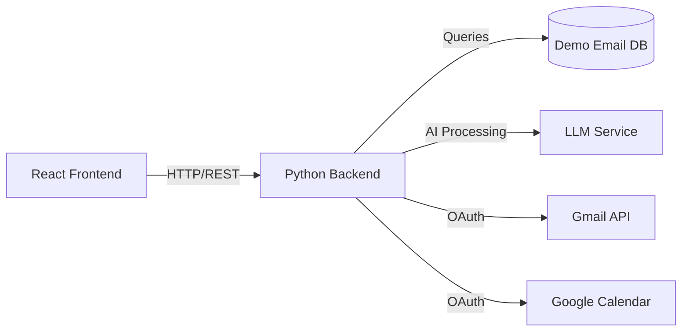
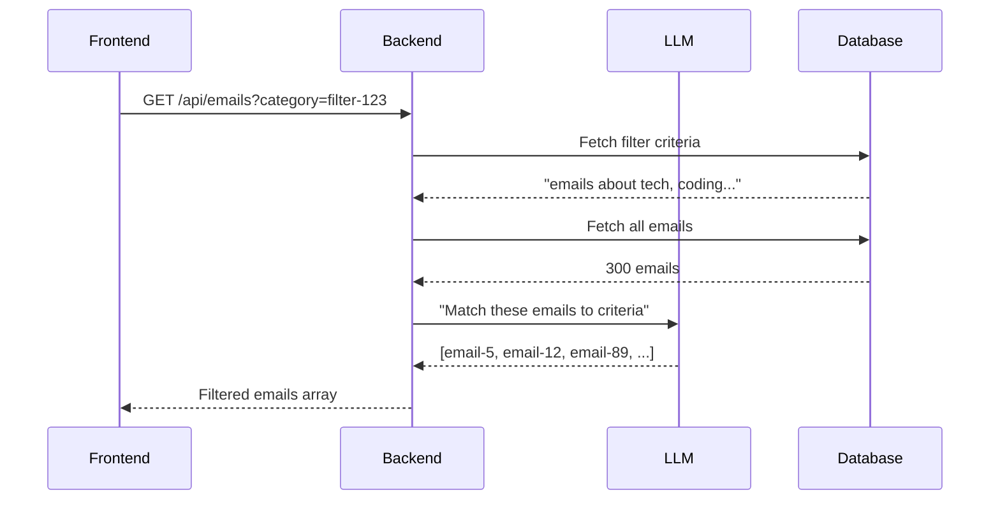
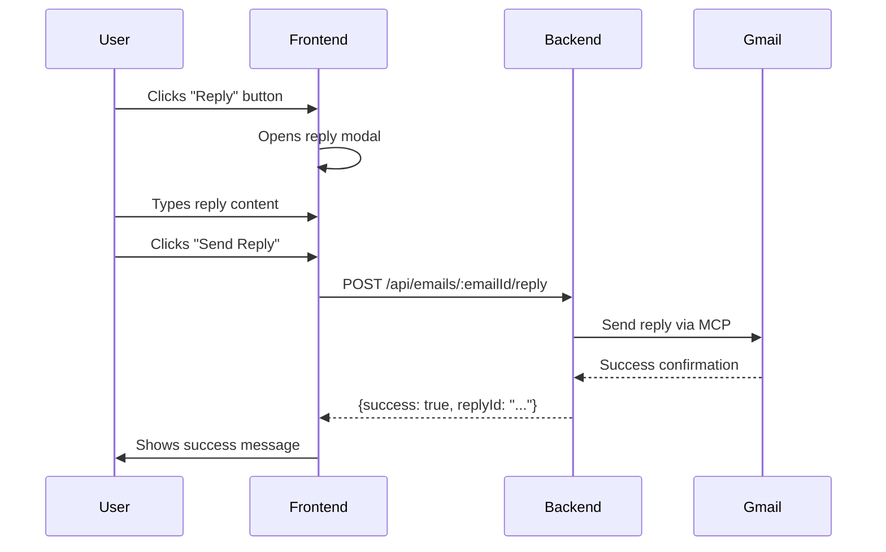
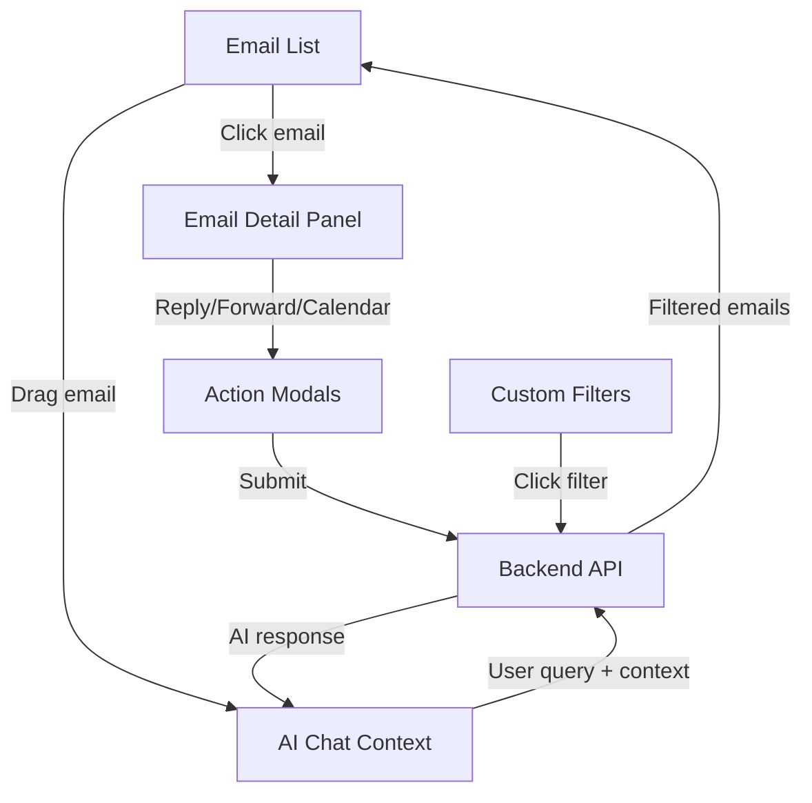
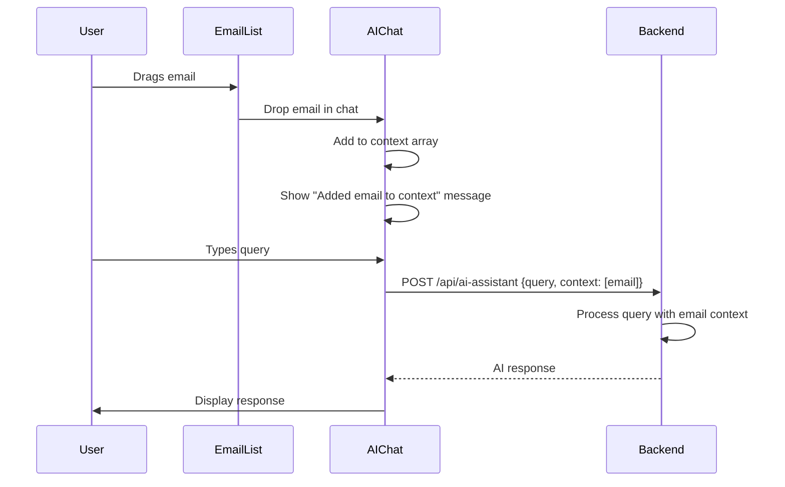

# Email Dashboard Backend API Documentation

**Version:** 1.0  
**Last Updated:** January 15, 2026  
**Frontend Component:** `src/pages/EmailDashboardDemo5.jsx`

---

## Table of Contents

1. [Implementation Status](#implementation-status)
2. [Overview](#overview)
3. [Data Structures](#data-structures)
4. [API Endpoints](#api-endpoints)
5. [AI Assistant Integration](#ai-assistant-integration)
6. [Custom Filters](#custom-filters)
7. [Email Actions](#email-actions)
8. [Error Handling](#error-handling)
9. [Testing](#testing)

---

## Implementation Status

### ✅ What Backend Has Implemented

**Core Services (4 files, ~2,220 lines):**
- `classification_service.py` (415 lines) - Claude Haiku AI classification with Redis caching
- `demo_data_seeder.py` (806 lines) - Generates 300 realistic demo emails per user
- `email_service.py` (650 lines) - Email list, filtering, search, custom filters
- `thread_service.py` (349 lines) - Thread reconstruction and replies

**Database Schema:**
- ✅ `demo_emails` table (300 emails per user)
- ✅ `demo_replies` table (threaded conversations)
- ✅ `custom_filters` table (AI-powered filters)
- ✅ `demo_data_status` table (tracks seeding status)
- ✅ Full-text search indexes
- ✅ User isolation via `user_hash` column

**API Endpoints (16 implemented):**
- ✅ `GET /api/emails` - Paginated email list (TESTED & WORKING)
- ✅ `GET /api/emails/{id}` - Single email details
- ✅ `PUT /api/emails/{id}/read` - Mark read/unread
- ✅ `PUT /api/emails/{id}/star` - Star/unstar email
- ✅ `DELETE /api/emails/{id}` - Delete email
- ✅ `GET /api/emails/stats` - Category counts and stats
- ✅ `GET /api/emails/search` - Full-text search
- ✅ `GET /api/emails/threads/{id}` - Thread details
- ✅ `PUT /api/emails/threads/{id}/read` - Mark thread as read
- ✅ `POST /api/emails/threads/{id}/reply` - Add reply
- ✅ `GET /api/emails/threads` - Threaded email list
- ✅ `GET /api/filters` - Get custom filters
- ✅ `POST /api/filters` - Create custom filter
- ✅ `DELETE /api/filters/{id}` - Delete filter
- ✅ `GET /api/filters/{id}/apply` - Apply filter

**Key Features Completed:**
- ✅ User isolation (each user gets their own 300 demo emails)
- ✅ Auto-seeding on first API call
- ✅ 5 categories: urgent (10%), meetings (25%), bills (15%), personal (20%), social (30%)
- ✅ Claude Haiku AI classification with Redis caching (24hr TTL)
- ✅ Keyword fallback for performance
- ✅ 10 threaded conversations with 2-4 replies each
- ✅ Timestamps spanning last 30 days
- ✅ PostgreSQL full-text search
- ✅ External access via NGINX: `https://api.airthreads.ai:5001/api/emails`

### ⏳ Still Needed for Frontend Integration

**Critical for Demo:**
- ❌ `POST /api/ai-assistant` - AI queries with email context (drag-and-drop feature)
- ❌ `POST /api/emails/:id/reply` - Send reply via Gmail MCP
- ❌ `POST /api/emails/:id/forward` - Forward email via Gmail MCP
- ❌ `POST /api/calendar/create-event` - Create Google Calendar event

**Important Notes:**
- Backend uses **5 categories** (urgent, meetings, bills, personal, social)
- Frontend sidebar shows **6 filters** (All, Work, Personal, Finance, Urgent, Social)
- Frontend category mapping needs to align with backend's 5 categories

### 🔗 Backend Access

```bash
# Successfully tested:
curl https://api.airthreads.ai:5001/api/emails?page=1&per_page=3 \
  -H "Cookie: userIDHash=test-api-001"
```

---

## Overview

This document specifies the backend API requirements for the Email Dashboard Demo feature. The frontend is a React-based email client with AI-powered assistance, email threading, drag-and-drop context management, and custom semantic filters.

### Key Features
- Email list with pagination (20 emails per page)
- Category-based filtering (All, Work, Personal, Finance, Urgent, Social)
- Full-text search across subject, sender, and content
- Email threading with multi-message conversations
- AI assistant with contextual email understanding
- Custom AI-powered filters (semantic search)
- Email actions: Reply, Forward, Create Calendar Event
- Drag-and-drop email context for AI queries

### Architecture


---

## Data Structures

### Email Object

Complete email object structure as expected by the frontend:

```typescript
interface Email {
  // Core identifiers
  id: string;                    // Unique email ID, e.g., "email-123"
  threadId: string;              // Thread identifier for grouping, e.g., "thread-45"
  
  // Content fields
  subject: string;               // Email subject line
  from: string;                  // Sender email address, e.g., "sarah.johnson@company.com"
  body: string;                  // Full email body (multi-line text with \n)
  snippet: string;               // Preview text (first ~100 chars)
  
  // Timestamps
  receivedAt: string;            // ISO 8601 timestamp, e.g., "2026-01-15T14:30:00.000Z"
  
  // Status flags
  isRead: boolean;               // Has user read this email?
  isStarred: boolean;            // Has user starred this email?
  hasAttachment: boolean;        // Does email have attachments?
  
  // Classification
  category: string;              // One of: urgent, meetings, bills, personal, social
  urgency: string;               // One of: "high", "medium", "low"
  
  // Category metadata (for UI styling)
  categoryMeta: {
    label: string;               // Human-readable label, e.g., "Meetings"
    color: string;               // Hex color code, e.g., "#7c3aed"
    icon: string;                // Emoji icon, e.g., "📅"
    description?: string;        // Optional description
  };
  
  // Thread support
  replies?: Reply[];             // Array of reply emails (if this is original email in thread)
  replyCount?: number;           // Number of replies (derived from replies.length)
}

interface Reply {
  id: string;                    // Unique reply ID
  from: string;                  // Reply sender email
  body: string;                  // Reply message content
  receivedAt: string;            // ISO 8601 timestamp
  isRead: boolean;               // Read status
}
```

### Category Metadata

Standard categories with their metadata (as implemented by backend):

```json
{
  "urgent": { "label": "Urgent", "color": "#dc2626", "icon": "🔴", "description": "Requires immediate attention" },
  "meetings": { "label": "Meetings", "color": "#7c3aed", "icon": "📅", "description": "Calendar invites, interviews, and meeting requests" },
  "bills": { "label": "Bills & Payments", "color": "#059669", "icon": "💳", "description": "Invoices, statements, receipts, and payment reminders" },
  "personal": { "label": "Personal", "color": "#8b5cf6", "icon": "💬", "description": "Messages from friends and family" },
  "social": { "label": "Social", "color": "#ec4899", "icon": "👥", "description": "Social network notifications, newsletters, and promotional emails" }
}
```

**Backend Distribution (per user, 300 emails total):**
- urgent: 10% (~30 emails)
- meetings: 25% (~75 emails)
- bills: 15% (~45 emails)
- personal: 20% (~60 emails)
- social: 30% (~90 emails)

### Custom Filter Object

```typescript
interface CustomFilter {
  id: string;                    // Unique filter ID, e.g., "filter-1642123456789"
  name: string;                  // User-defined name, e.g., "Tech Updates"
  criteria: string;              // Natural language criteria, e.g., "find me all emails related to tech, interviews, coding"
  createdAt?: string;            // ISO timestamp when filter was created
}
```

### AI Message Object

Used in the AI assistant chat:

```typescript
interface AIMessage {
  role: "user" | "assistant";    // Message sender
  content: string;               // Message text
  variant?: "context";           // Special variant for context updates (add/remove email)
}
```

---

## API Endpoints

### 1. GET /api/emails

Fetch paginated list of emails with optional filtering.

**Query Parameters:**
```
category    (string, optional)  - Filter by category: "all", "work", "personal", "finance", "urgent", "social"
                                  OR custom filter ID (e.g., "filter-1642123456789")
search      (string, optional)  - Search query (searches subject, from, snippet, body)
page        (number, optional)  - Page number (default: 1)
limit       (number, optional)  - Items per page (default: 20, max: 100)
```

**Category Mapping (for standard categories):**
- `all` → No filter (all emails)
- `work` → Categories: `['meetings', 'interviews']`
- `personal` → Categories: `['personal', 'social']`
- `finance` → Categories: `['bills', 'receipts']`
- `urgent` → Categories: `['urgent']`
- `social` → Categories: `['social', 'newsletters', 'promotional']`

**Request Example:**
```bash
GET /api/emails?category=work&page=1&limit=20
GET /api/emails?search=project&page=1
GET /api/emails?category=filter-1642123456789&page=1
```

**Response Format:**
```json
{
  "emails": [
    {
      "id": "email-1",
      "threadId": "thread-1",
      "subject": "Project Kickoff Meeting - Next Tuesday",
      "from": "sarah.johnson@company.com",
      "body": "Hi team!\n\nI wanted to schedule our project kickoff meeting...",
      "snippet": "Hi team! I wanted to schedule our project kickoff meeting for next Tuesday at 2 PM...",
      "receivedAt": "2026-01-15T12:30:00.000Z",
      "isRead": false,
      "isStarred": false,
      "hasAttachment": false,
      "category": "meetings",
      "urgency": "high",
      "categoryMeta": {
        "label": "Meetings",
        "color": "#7c3aed",
        "icon": "📅",
        "description": "Calendar invites and meeting requests"
      },
      "replies": [
        {
          "id": "email-2",
          "from": "alex.chen@company.com",
          "body": "Perfect timing! I'll be there.",
          "receivedAt": "2026-01-15T13:00:00.000Z",
          "isRead": true
        }
      ],
      "replyCount": 1
    }
  ],
  "pagination": {
    "currentPage": 1,
    "totalPages": 15,
    "totalCount": 300,
    "hasNextPage": true,
    "hasPrevPage": false
  },
  "categoryCounts": {
    "all": 300,
    "work": 69,
    "personal": 56,
    "finance": 60,
    "urgent": 32,
    "social": 84
  },
  "unreadCount": 91
}
```

**Notes:**
- Emails should be sorted by `receivedAt` DESC (newest first)
- For custom filters (filter ID starting with "filter-"), use LLM to semantically match emails based on filter criteria
- Always include `categoryMeta` for proper UI rendering
- `replyCount` should equal `replies.length` when replies exist

---

### 2. GET /api/emails/threads/:threadId

Fetch complete email thread with all messages.

**Path Parameters:**
```
threadId    (string, required)  - Thread identifier, e.g., "thread-1"
```

**Request Example:**
```bash
GET /api/emails/threads/thread-1
```

**Response Format:**
```json
{
  "thread": {
    "threadId": "thread-1",
    "subject": "Project Kickoff Meeting - Next Tuesday",
    "messageCount": 4,
    "participants": [
      "sarah.johnson@company.com",
      "alex.chen@company.com",
      "mike.rodriguez@company.com"
    ],
    "messages": [
      {
        "id": "email-1",
        "from": "sarah.johnson@company.com",
        "body": "Hi team!\n\nI wanted to schedule our project kickoff meeting...",
        "receivedAt": "2026-01-15T12:30:00.000Z",
        "isRead": false
      },
      {
        "id": "email-2",
        "from": "alex.chen@company.com",
        "body": "Perfect timing! I'll be there.",
        "receivedAt": "2026-01-15T13:00:00.000Z",
        "isRead": true
      }
    ]
  }
}
```

**Notes:**
- Messages should be sorted chronologically (oldest first)
- Include full email bodies for all messages in thread
- First message is the original email, subsequent messages are replies

---

### 3. POST /api/ai-assistant

Send user query to AI assistant with optional email context.

**Request Body:**
```json
{
  "query": "Summarize my work emails",
  "context": [
    {
      "id": "email-1",
      "threadId": "thread-1",
      "subject": "Project Kickoff Meeting",
      "from": "sarah.johnson@company.com",
      "body": "Hi team!\n\nI wanted to schedule...",
      "snippet": "Hi team! I wanted to schedule our project...",
      "category": "meetings",
      "urgency": "high"
    }
  ]
}
```

**Request Fields:**
- `query` (string, required): User's natural language question
- `context` (array, optional): Array of email objects the user dragged into context

**Response Format:**
```json
{
  "response": "Based on the 2 email(s) in context:\n\n1. \"Project Kickoff Meeting\" - Hi team! I wanted to schedule...\n2. \"Interview Confirmation\" - We are pleased to confirm your interview...",
  "timestamp": "2026-01-15T14:30:00.000Z"
}
```

**Frontend Usage Reference:**
```javascript
// src/pages/EmailDashboardDemo5.jsx, lines 352-403
const handleAiSubmit = async (e) => {
  const response = await fetch('/api/ai-assistant', {
    method: 'POST',
    headers: { 'Content-Type': 'application/json' },
    credentials: 'include',
    body: JSON.stringify({ 
      query: userMessage, 
      context: emailContext  // Array of dragged emails
    }),
  });
  const data = await response.json();
  // Expects: { response: string }
};
```

**AI Processing Requirements:**
- Analyze the user's query
- If `context` array is provided, prioritize those emails in the response
- Support queries like:
  - "Summarize these emails"
  - "Show me urgent emails"
  - "Who sent this?"
  - "When is the meeting?"
- Return natural language responses
- No need to return structured data for demo (just text responses)

---

### 4. POST /api/custom-filters

Create a new custom AI-powered filter.

**Request Body:**
```json
{
  "name": "Tech Updates",
  "criteria": "find me all emails related to tech, interviews, coding, engineering, software, etc"
}
```

**Response Format:**
```json
{
  "filter": {
    "id": "filter-1642123456789",
    "name": "Tech Updates",
    "criteria": "find me all emails related to tech, interviews, coding, engineering, software, etc",
    "createdAt": "2026-01-15T14:30:00.000Z"
  },
  "message": "Custom filter created successfully"
}
```

**Notes:**
- The `criteria` field should be stored as-is for LLM processing
- When this filter is selected, use LLM to semantically match emails
- Filter ID should be unique and prefixed with "filter-"

---

### 5. GET /api/custom-filters

Retrieve all custom filters for the current user.

**Request Example:**
```bash
GET /api/custom-filters
```

**Response Format:**
```json
{
  "filters": [
    {
      "id": "filter-1642123456789",
      "name": "Tech Updates",
      "criteria": "find me all emails related to tech, interviews, coding, engineering, software, etc",
      "createdAt": "2026-01-15T14:30:00.000Z"
    },
    {
      "id": "filter-1642123456790",
      "name": "Client Communications",
      "criteria": "emails from clients, customer feedback, support requests",
      "createdAt": "2026-01-15T15:00:00.000Z"
    }
  ]
}
```

---

### 6. DELETE /api/custom-filters/:filterId

Delete a custom filter.

**Path Parameters:**
```
filterId    (string, required)  - Filter ID to delete, e.g., "filter-1642123456789"
```

**Request Example:**
```bash
DELETE /api/custom-filters/filter-1642123456789
```

**Response Format:**
```json
{
  "success": true,
  "message": "Filter deleted successfully"
}
```

---

### 7. POST /api/emails/:emailId/reply

Send a reply to an email.

**Path Parameters:**
```
emailId     (string, required)  - Email ID to reply to
```

**Request Body:**
```json
{
  "content": "Thanks for the update! I'll review the document and get back to you by EOD.",
  "threadId": "thread-1"
}
```

**Response Format:**
```json
{
  "success": true,
  "message": "Reply sent successfully",
  "replyId": "email-456",
  "threadId": "thread-1"
}
```

**Frontend Usage Reference:**
```javascript
// src/pages/EmailDashboardDemo5.jsx, lines 271-276
const handleSendReply = () => {
  console.log('Sending reply:', replyContent);
  // Backend should receive: { content: replyContent, threadId: selectedEmail.threadId }
};
```

---

### 8. POST /api/emails/:emailId/forward

Forward an email to another recipient.

**Path Parameters:**
```
emailId     (string, required)  - Email ID to forward
```

**Request Body:**
```json
{
  "to": "colleague@company.com",
  "note": "FYI - thought this might be relevant to your project"
}
```

**Response Format:**
```json
{
  "success": true,
  "message": "Email forwarded successfully",
  "forwardedEmailId": "email-789"
}
```

**Frontend Usage Reference:**
```javascript
// src/pages/EmailDashboardDemo5.jsx, lines 278-284
const handleSendForward = () => {
  console.log('Forwarding to:', forwardTo, 'with note:', forwardNote);
  // Backend should receive: { to: forwardTo, note: forwardNote }
};
```

---

### 9. POST /api/calendar/create-event

Create a calendar event from an email (integrates with Google Calendar MCP).

**Request Body:**
```json
{
  "title": "Project Kickoff Meeting - Next Tuesday",
  "date": "2026-01-20",
  "time": "14:00",
  "notes": "Discuss project timeline and milestones\nReview team roles",
  "emailId": "email-1",
  "threadId": "thread-1"
}
```

**Response Format:**
```json
{
  "success": true,
  "message": "Calendar event created successfully",
  "event": {
    "eventId": "cal-event-123",
    "title": "Project Kickoff Meeting - Next Tuesday",
    "startTime": "2026-01-20T14:00:00.000Z",
    "calendarLink": "https://calendar.google.com/calendar/event?eid=..."
  }
}
```

**Frontend Usage Reference:**
```javascript
// src/pages/EmailDashboardDemo5.jsx, lines 286-290
const handleCreateCalendarEvent = () => {
  console.log('Creating event:', { 
    eventTitle,    // Event title
    eventDate,     // Date (YYYY-MM-DD)
    eventTime,     // Time (HH:MM)
    eventNotes     // Optional notes
  });
};
```

**Integration Notes:**
- Use existing Google Calendar MCP server for actual calendar creation
- Link event back to source email via `emailId` and `threadId`
- Return calendar event link for user confirmation

---

### 10. POST /api/emails/update-status

Batch update email status (read, star, archive).

**Request Body:**
```json
{
  "emailIds": ["email-1", "email-2", "email-3"],
  "updates": {
    "isRead": true,
    "isStarred": false,
    "isArchived": false
  }
}
```

**Response Format:**
```json
{
  "success": true,
  "updated": 3,
  "message": "3 email(s) updated successfully"
}
```

**Frontend Context:**
- Frontend tracks starred emails in local state (`Set` in `EmailDashboardDemo5.jsx:52`)
- Frontend filters out archived emails (`Set` in `EmailDashboardDemo5.jsx:53`)
- Backend should persist these states for production use

---

## AI Assistant Integration

### Context Management

The AI assistant has two modes of operation:

**1. Without Context (General Queries)**
User asks questions about their inbox without dragging specific emails.

Example queries:
- "Show me urgent emails"
- "How many unread emails do I have?"
- "What work emails came in today?"

Backend should query the email database and return natural language summaries.

**2. With Context (Specific Email Analysis)**
User drags emails into the chat (adds to context), then asks questions about those specific emails.

Frontend sends in request:
```json
{
  "query": "Summarize these emails",
  "context": [
    { "id": "email-1", "subject": "...", "body": "...", ... },
    { "id": "email-2", "subject": "...", "body": "...", ... }
  ]
}
```

Backend should:
1. Prioritize the emails in `context` array
2. Use LLM to analyze those specific emails
3. Answer questions based on the provided context

### Context Update Messages

When emails are added/removed from context, the frontend displays special "context update" messages with a distinct UI style.

**Message Variants:**
```javascript
// Adding email to context
{
  role: "assistant",
  variant: "context",
  content: `Added "Project Kickoff Meeting" to context. You can now ask questions about this email.`
}

// Removing email from context
{
  role: "assistant",
  variant: "context",
  content: `Removed "Project Kickoff Meeting" from context.`
}
```

**Frontend Rendering:**
These messages have a special `variant: "context"` flag that triggers different styling (see `EmailDashboardDemo5.module.css` lines 1295-1350 for `.contextUpdate` styles).

**Backend Consideration:**
Backend does NOT need to generate these messages - they are generated client-side when user drags/drops emails. Backend only needs to handle the `context` array in `/api/ai-assistant` requests.

---

## Custom Filters (AI-Powered Semantic Search)

### Overview

Custom filters allow users to create semantic email filters using natural language. Unlike traditional filters that match exact keywords, these use LLM-based semantic understanding.

### User Flow

1. User clicks "+" button in "CUSTOM FILTERS" sidebar section
2. Modal opens with two fields:
   - **Filter Name**: "Tech Updates"
   - **Search Criteria**: "find me all emails related to tech, interviews, coding, engineering, software development"
3. User saves the filter
4. Filter appears in sidebar below standard categories
5. When clicked, backend performs semantic search and returns matching emails

### Backend Implementation Requirements

**Filter Creation (POST /api/custom-filters):**
- Store filter name and criteria in database
- Associate with user session/account
- Return unique filter ID

**Filter Application (GET /api/emails?category=filter-123):**
When a custom filter is selected, the `category` parameter will be the filter ID.



**LLM Processing:**
1. Retrieve filter criteria from database using filter ID
2. Fetch all user emails (or a reasonable subset)
3. Use LLM to evaluate each email against criteria
4. Return only semantically matching emails

**Example LLM Prompt:**
```
Given this filter criteria: "find me all emails related to tech, interviews, coding, engineering, software development"

Analyze these emails and return the IDs of emails that match this criteria:

Email 1 (ID: email-1): Subject: "Project Kickoff Meeting", Content: "Hi team! Let's discuss..."
Email 2 (ID: email-2): Subject: "Interview Confirmation - Software Engineer", Content: "We are pleased to confirm..."
Email 3 (ID: email-3): Subject: "Your electricity bill is ready", Content: "Your bill for December..."

Return matching email IDs as JSON array: ["email-1", "email-2"]
```

**Performance Considerations:**
- Cache filter results for 5-10 minutes
- Limit LLM analysis to most recent 100-200 emails
- For large inboxes, consider vector embeddings + similarity search

---

## Email Actions

### Reply Workflow



**Frontend Modal Data:**
```javascript
// When user clicks Reply (EmailDashboardDemo5.jsx:252-255)
{
  replyContent: "User's typed reply message...",
  selectedEmail: {
    id: "email-1",
    threadId: "thread-1",
    subject: "Project Kickoff Meeting",
    from: "sarah.johnson@company.com"
  }
}
```

**Backend Should:**
- Extract reply content and email metadata
- Use Gmail MCP to send reply (reply-to: original sender)
- Maintain thread continuity (use threadId)
- Return confirmation with new reply ID

---

### Forward Workflow

Similar to reply, but user specifies recipient(s) and optional note.

**Frontend Modal Data:**
```javascript
// When user clicks Forward (EmailDashboardDemo5.jsx:256-261)
{
  forwardTo: "colleague@company.com",
  forwardNote: "FYI - thought this might be useful",
  selectedEmail: { /* full email object */ }
}
```

**Backend Should:**
- Forward original email body to specified recipient
- Prepend user's note if provided
- Add "Forwarded from..." header for context

---

### Calendar Event Creation Workflow

**Frontend Modal Data:**
```javascript
// When user clicks "Add to..." → "Google Calendar" (EmailDashboardDemo5.jsx:263-269)
{
  eventTitle: "Project Kickoff Meeting - Next Tuesday",  // Pre-filled from email subject
  eventDate: "2026-01-20",                               // User selects
  eventTime: "14:00",                                    // User selects
  eventNotes: "Discuss timeline\nReview roles",          // Optional user input
  selectedEmail: {
    id: "email-1",
    threadId: "thread-1",
    subject: "Project Kickoff Meeting",
    from: "sarah.johnson@company.com"
  }
}
```

**Backend Should:**
- Use Google Calendar MCP server to create event
- Combine date + time into proper datetime
- Link event metadata back to source email
- Return calendar event link for confirmation

---

## Error Handling

### Standard Error Response Format

All endpoints should return consistent error responses:

```json
{
  "success": false,
  "error": {
    "code": "VALIDATION_ERROR",
    "message": "Invalid email ID provided",
    "details": {
      "field": "emailId",
      "issue": "Email not found in database"
    }
  }
}
```

### Error Codes

| Code | HTTP Status | Description | Example Scenario |
|------|-------------|-------------|------------------|
| `VALIDATION_ERROR` | 400 | Invalid request data | Missing required fields |
| `NOT_FOUND` | 404 | Resource not found | Email ID doesn't exist |
| `UNAUTHORIZED` | 401 | Authentication required | User not logged in |
| `RATE_LIMIT` | 429 | Too many requests | User exceeded API quota |
| `LLM_ERROR` | 503 | LLM service unavailable | OpenAI API timeout |
| `MCP_ERROR` | 502 | MCP server error | Gmail/Calendar MCP unavailable |
| `INTERNAL_ERROR` | 500 | Server error | Unexpected exception |

### Frontend Error Handling

The frontend displays user-friendly error messages in the chat:

```javascript
// Example from frontend code
catch (error) {
  setAiMessages(prev => [...prev, {
    role: 'assistant',
    content: `⚠️ ${error.message}`
  }]);
}
```

**Backend Should:**
- Always return JSON (even for errors)
- Include helpful error messages
- Log detailed errors server-side for debugging
- Return 200 OK for successful requests, appropriate 4xx/5xx for errors

---

## Testing

### Sample Email Data

Backend should seed database with diverse email examples covering all categories. Reference: `src/data/mockEmailData.js`

**Required Coverage:**
- All 5 categories (urgent, meetings, bills, personal, social)
- Mix of urgency levels (high, medium, low)
- 10 threaded conversations (with 2-4 replies each) - ✅ IMPLEMENTED
- Mix of read/unread emails
- Various senders and subjects
- Timestamps spanning the last 30 days - ✅ IMPLEMENTED

**Test Thread Example:**
```json
{
  "id": "test-email-1",
  "threadId": "test-thread-1",
  "subject": "Project Kickoff Meeting - Next Tuesday",
  "from": "sarah.johnson@company.com",
  "body": "Hi team!\n\nI wanted to schedule our project kickoff meeting for next Tuesday at 2 PM...",
  "snippet": "Hi team! I wanted to schedule our project kickoff meeting...",
  "receivedAt": "2026-01-15T12:00:00.000Z",
  "isRead": false,
  "category": "meetings",
  "urgency": "high",
  "replies": [
    {
      "id": "test-email-2",
      "from": "alex.chen@company.com",
      "body": "Perfect timing! I'll be there.",
      "receivedAt": "2026-01-15T12:30:00.000Z",
      "isRead": true
    },
    {
      "id": "test-email-3",
      "from": "mike.rodriguez@company.com",
      "body": "Tuesday at 2 PM works for me. Should I prepare anything beforehand?",
      "receivedAt": "2026-01-15T13:00:00.000Z",
      "isRead": true
    }
  ],
  "replyCount": 2
}
```

### cURL Testing Commands

**1. Fetch Emails (All Categories):**
```bash
curl -X GET "http://localhost:8000/api/emails?category=all&page=1&limit=20" \
  -H "Content-Type: application/json" \
  -b cookies.txt
```

**2. Fetch Emails (Work Category):**
```bash
curl -X GET "http://localhost:8000/api/emails?category=work&page=1&limit=20" \
  -H "Content-Type: application/json" \
  -b cookies.txt
```

**3. Search Emails:**
```bash
curl -X GET "http://localhost:8000/api/emails?search=project&page=1&limit=20" \
  -H "Content-Type: application/json" \
  -b cookies.txt
```

**4. Get Email Thread:**
```bash
curl -X GET "http://localhost:8000/api/emails/threads/thread-1" \
  -H "Content-Type: application/json" \
  -b cookies.txt
```

**5. AI Assistant Query (Without Context):**
```bash
curl -X POST "http://localhost:8000/api/ai-assistant" \
  -H "Content-Type: application/json" \
  -d '{
    "query": "Show me urgent emails",
    "context": []
  }' \
  -b cookies.txt
```

**6. AI Assistant Query (With Context):**
```bash
curl -X POST "http://localhost:8000/api/ai-assistant" \
  -H "Content-Type: application/json" \
  -d '{
    "query": "Summarize these emails",
    "context": [
      {
        "id": "email-1",
        "subject": "Project Kickoff Meeting",
        "body": "Hi team! I wanted to schedule...",
        "from": "sarah.johnson@company.com"
      }
    ]
  }' \
  -b cookies.txt
```

**7. Create Custom Filter:**
```bash
curl -X POST "http://localhost:8000/api/custom-filters" \
  -H "Content-Type: application/json" \
  -d '{
    "name": "Tech Updates",
    "criteria": "find me all emails related to tech, interviews, coding, engineering"
  }' \
  -b cookies.txt
```

**8. Get Custom Filters:**
```bash
curl -X GET "http://localhost:8000/api/custom-filters" \
  -H "Content-Type: application/json" \
  -b cookies.txt
```

**9. Delete Custom Filter:**
```bash
curl -X DELETE "http://localhost:8000/api/custom-filters/filter-1642123456789" \
  -H "Content-Type: application/json" \
  -b cookies.txt
```

**10. Reply to Email:**
```bash
curl -X POST "http://localhost:8000/api/emails/email-1/reply" \
  -H "Content-Type: application/json" \
  -d '{
    "content": "Thanks for the update! I will review and get back to you.",
    "threadId": "thread-1"
  }' \
  -b cookies.txt
```

**11. Forward Email:**
```bash
curl -X POST "http://localhost:8000/api/emails/email-1/forward" \
  -H "Content-Type: application/json" \
  -d '{
    "to": "colleague@company.com",
    "note": "FYI - relevant to your project"
  }' \
  -b cookies.txt
```

**12. Create Calendar Event:**
```bash
curl -X POST "http://localhost:8000/api/calendar/create-event" \
  -H "Content-Type: application/json" \
  -d '{
    "title": "Project Kickoff Meeting",
    "date": "2026-01-20",
    "time": "14:00",
    "notes": "Discuss timeline and milestones",
    "emailId": "email-1",
    "threadId": "thread-1"
  }' \
  -b cookies.txt
```

---

## Frontend Integration Reference

### Key Files

1. **Main Component**: `src/pages/EmailDashboardDemo5.jsx` (1,237 lines)
   - Email list rendering
   - AI assistant chat
   - Drag-and-drop context management
   - Modal handlers for reply/forward/calendar

2. **Mock Data**: `src/data/mockEmailData.js` (258 lines)
   - Email object structure reference
   - Category definitions
   - Thread relationship examples

3. **Styles**: `src/pages/EmailDashboardDemo5.module.css` (1,900+ lines)
   - UI component styling
   - Animations and transitions
   - Dark mode support

### Data Flow Diagram



### State Management

Frontend manages the following state locally:

**Client-Side Only (No Backend Persistence Needed for Demo):**
- `selectedEmail` - Currently viewed email
- `emailContext` - Dragged emails in AI context
- `aiMessages` - Chat conversation history
- `starredEmails` - Set of starred email IDs (would need persistence in production)
- `archivedEmails` - Set of archived email IDs (would need persistence in production)

**Should Be Synced with Backend:**
- `customFilters` - User's custom semantic filters
- Email status updates (read/starred/archived) - for production use

---

## Pagination Details

### Frontend Expectations

- **Page size**: 20 emails per page (constant: `EMAILS_PER_PAGE = 20`)
- **Page numbering**: 1-indexed (page 1, page 2, etc.)
- **Scroll behavior**: When page changes, email list scrolls to top

### Backend Response

Always include pagination metadata:

```json
{
  "pagination": {
    "currentPage": 1,
    "totalPages": 15,
    "totalCount": 300,
    "itemsPerPage": 20,
    "hasNextPage": true,
    "hasPrevPage": false
  }
}
```

### Performance

- For demo purposes, returning 300 emails is acceptable
- For production, implement cursor-based pagination for better performance
- Cache frequently accessed pages (first 3-5 pages)

---

## Category Counts

The sidebar shows email counts next to each category. Backend should return these counts with every `/api/emails` request.

**Expected Format:**
```json
{
  "categoryCounts": {
    "all": 300,      // Total non-archived emails
    "work": 69,      // Emails in meetings + interviews categories
    "personal": 56,  // Emails in personal + social categories
    "finance": 60,   // Emails in bills + receipts categories
    "urgent": 32,    // Emails with urgent category
    "social": 84     // Emails in social + newsletters + promotional categories
  },
  "unreadCount": 91  // Total unread emails across all categories
}
```

**Frontend Usage:**
```javascript
// src/pages/EmailDashboardDemo5.jsx, lines 118-125
const categoryCounts = useMemo(() => {
  const counts = { all: mockEmails.filter(e => !archivedEmails.has(e.id)).length };
  Object.keys(CATEGORY_MAPPING).forEach(cat => {
    const cats = CATEGORY_MAPPING[cat];
    counts[cat] = mockEmails.filter(e => !archivedEmails.has(e.id) && cats?.includes(e.category)).length;
  });
  return counts;
}, [archivedEmails]);
```

---

## Search Implementation

### Frontend Behavior

Search is performed client-side in the frontend (lines 91-98), but backend should support server-side search for production.

**Search Fields:**
- `subject` - Email subject line
- `from` - Sender email address
- `snippet` - Email preview text
- `body` - Full email content

**Search Algorithm:**
- Case-insensitive substring matching
- Searches all fields simultaneously (OR logic)
- Returns results in chronological order (newest first)

**Backend Implementation:**
```sql
-- Example SQL query
SELECT * FROM emails 
WHERE (
  LOWER(subject) LIKE LOWER('%query%') OR
  LOWER(from_email) LIKE LOWER('%query%') OR
  LOWER(snippet) LIKE LOWER('%query%') OR
  LOWER(body) LIKE LOWER('%query%')
)
AND is_archived = false
ORDER BY received_at DESC
LIMIT 20 OFFSET 0;
```

---

## Authentication & Session Management

### Current Frontend Approach

The main AirThreads product (`src/pages/ProductPage.jsx`) uses cookie-based authentication with Gmail and Calendar OAuth.

**For Email Dashboard Demo:**
- Session management is simplified
- No OAuth flows required (demo uses mock/seeded data)
- Backend can use simple session cookies or anonymous user IDs
- Credentials sent via `credentials: 'include'` in fetch requests

**Example:**
```javascript
fetch('/api/emails', {
  method: 'GET',
  credentials: 'include',  // Sends cookies automatically
  headers: { 'Content-Type': 'application/json' }
});
```

**Backend Should:**
- Set session cookie on first request
- Associate emails and filters with session ID
- Allow anonymous demo usage (no login required)

---

## Performance Considerations

### Frontend Rendering

- Virtualization: Not implemented (renders all 20 visible emails)
- Pagination: Loads 20 emails at a time
- Context: Unlimited emails can be dragged to context (consider limiting to 10-20)

### Backend Recommendations

1. **Email Fetching:**
   - Index emails by category, urgency, receivedAt
   - Return only requested page (don't send all 300 emails)
   - Include counts in every response (sidebar needs them)

2. **Thread Loading:**
   - Load replies lazily (only when email is clicked)
   - Or include replies inline if threads are small (< 5 messages)

3. **AI Assistant:**
   - Set timeout for LLM queries (30 seconds max)
   - Cache common queries ("show urgent emails")
   - Limit context to 10 emails max for LLM processing

4. **Custom Filters:**
   - Cache semantic search results (5-10 minutes)
   - Pre-compute embeddings for emails
   - Limit LLM analysis to recent 100-200 emails

---

## Drag-and-Drop Context Flow

### User Interaction



### Context Update Messages

**Frontend Generates These (No Backend Action Needed):**

**Adding email:**
```javascript
// EmailDashboardDemo5.jsx, lines 212-221
setAiMessages(prev => [...prev, {
  role: 'assistant',
  variant: 'context',  // Special variant for context updates
  content: `Added "Project Kickoff Meeting" to context. You can now ask questions about this email.`
}]);
```

**Removing email:**
```javascript
// EmailDashboardDemo5.jsx, lines 228-236
setAiMessages(prev => [...prev, {
  role: 'assistant',
  variant: 'context',
  content: `Removed "Project Kickoff Meeting" from context.`
}]);
```

**Backend Consideration:**
- Context array is sent with each AI query
- Backend doesn't need to track context state
- Stateless AI queries (context included in each request)

---

## Thread Display Logic

### Frontend Thread Rendering

When an email with `replyCount > 0` is clicked, the detail panel displays:

1. **Thread Header**: Subject + "X messages" badge
2. **AI Summary**: "Thread with X replies. Requires immediate attention."
3. **Original Message**: Full email with avatar, sender, timestamp, body
4. **Replies**: Each reply as a separate card with avatar, sender, timestamp, body

**Data Requirements:**
- `replyCount` must match `replies.length`
- Replies sorted chronologically (oldest first)
- Each reply has its own avatar/sender info

### Thread Indicator in List

Emails with threads show a purple badge with reply count:

```html
<!-- EmailDashboardDemo5.jsx, lines 450-458 -->
<span className={styles.threadIndicator}>
  <svg><!-- chat bubble icon --></svg>
  {email.replyCount}
</span>
```

**Backend Must:**
- Always include `replyCount` if `replies.length > 0`
- Ensure reply IDs are unique
- Maintain chronological order in replies array

---

## Custom Filter Semantic Matching

### LLM Integration Strategy

When a custom filter is selected, backend must:

1. **Retrieve filter criteria** from database
2. **Fetch candidate emails** (all or recent subset)
3. **Use LLM to evaluate each email** against criteria
4. **Return matching emails** in standard format

### LLM Prompt Example

```python
# Backend pseudo-code
filter_criteria = "find me all emails related to tech, interviews, coding, engineering"

prompt = f"""
You are an email classification assistant. Given this filter criteria:
"{filter_criteria}"

Analyze the following emails and return ONLY the email IDs that match this criteria:

{json.dumps(emails_summary, indent=2)}

Return your response as a JSON array of email IDs: ["email-1", "email-5", ...]
"""

response = llm.query(prompt)
matching_ids = json.loads(response)
filtered_emails = [e for e in emails if e.id in matching_ids]
```

### Matching Algorithm

**Option 1: LLM-based (Recommended for demo):**
- Send email summaries to LLM with filter criteria
- LLM returns matching email IDs
- Pros: Accurate semantic understanding
- Cons: Slower, requires LLM API calls

**Option 2: Vector Embeddings (Production-ready):**
- Pre-compute embeddings for all emails
- Create embedding for filter criteria
- Use cosine similarity to find matches
- Pros: Fast, scalable
- Cons: More complex setup

**Option 3: Hybrid:**
- Use embeddings for initial filtering (top 50 candidates)
- Use LLM for final classification
- Pros: Balance of speed and accuracy
- Cons: More complex implementation

---

## Rate Limiting

### Frontend Expectations

The frontend does NOT implement rate limiting. Backend should:

- Limit AI assistant queries: 10 per minute per user
- Limit email fetches: 60 per minute per user
- Limit filter operations: 5 per minute per user

### Error Response

When rate limit is exceeded:

```json
{
  "success": false,
  "error": {
    "code": "RATE_LIMIT",
    "message": "Too many requests. Please wait 30 seconds before trying again.",
    "retryAfter": 30
  }
}
```

---

## Demo Data Requirements

### Minimum Dataset

Backend should seed database with:

- **Total Emails**: 300 per user (as implemented by backend)
- **Threaded Conversations**: 10 threads with 2-4 replies each (as implemented)
- **Categories Distribution** (5 categories total):
  - Urgent: ~30 emails (10%)
  - Meetings: ~75 emails (25%) - includes interviews, calendar invites
  - Bills: ~45 emails (15%) - includes receipts, invoices
  - Personal: ~60 emails (20%) - personal communications
  - Social: ~90 emails (30%) - includes newsletters, promotional, social notifications

- **Urgency Distribution**:
  - High: 15-20%
  - Medium: 40-50%
  - Low: 30-40%

- **Read Status**: 60-70% read, 30-40% unread
- **Time Range**: Last 30 days (most recent 2-3 days should have more emails)

### Test Email Thread (High Priority)

**Required Test Data**: Include the following thread at the top of the inbox (most recent):

```json
{
  "id": "test-email-1",
  "threadId": "test-thread-1",
  "category": "meetings",
  "subject": "Project Kickoff Meeting - Next Tuesday",
  "from": "sarah.johnson@company.com",
  "urgency": "high",
  "snippet": "Hi team! I wanted to schedule our project kickoff meeting for next Tuesday at 2 PM. Please let me know if this works for everyone.",
  "body": "Hi team!\n\nI wanted to schedule our project kickoff meeting for next Tuesday at 2 PM. We'll be discussing:\n\n- Project timeline and milestones\n- Team roles and responsibilities\n- Initial requirements gathering\n\nPlease let me know if this works for everyone. The meeting will be in Conference Room B.\n\nBest regards,\nSarah",
  "receivedAt": "2026-01-15T12:00:00.000Z",
  "isRead": false,
  "isStarred": false,
  "hasAttachment": false,
  "categoryMeta": {
    "label": "Meetings",
    "color": "#7c3aed",
    "icon": "📅"
  },
  "replies": [
    {
      "id": "test-email-2",
      "from": "alex.chen@company.com",
      "body": "Perfect timing! I'll be there. Looking forward to getting started on this project.",
      "receivedAt": "2026-01-15T12:30:00.000Z",
      "isRead": true
    },
    {
      "id": "test-email-3",
      "from": "mike.rodriguez@company.com",
      "body": "Tuesday at 2 PM works for me. Should I prepare anything beforehand?",
      "receivedAt": "2026-01-15T13:00:00.000Z",
      "isRead": true
    },
    {
      "id": "test-email-4",
      "from": "sarah.johnson@company.com",
      "body": "Great! @Mike - just review the project brief I sent last week. See you all on Tuesday!",
      "receivedAt": "2026-01-15T13:30:00.000Z",
      "isRead": false
    }
  ],
  "replyCount": 3
}
```

This thread allows easy testing of:
- Thread indicator in email list (shows "💬 3")
- Thread view with multiple messages
- Conversation flow with different senders
- Unread status in threads

---

## Implementation Checklist

### Backend Team To-Do

- [ ] Set up email database schema (PostgreSQL/MongoDB)
- [ ] Seed database with 300+ demo emails (use mockEmailData.js as reference)
- [ ] Implement GET /api/emails with filtering, search, pagination
- [ ] Implement GET /api/emails/threads/:threadId
- [ ] Implement POST /api/ai-assistant (integrate with LLM)
- [ ] Implement custom filter CRUD endpoints
- [ ] Implement email action endpoints (reply, forward, calendar)
- [ ] Set up rate limiting middleware
- [ ] Configure CORS for frontend domain
- [ ] Test with provided cURL commands
- [ ] Document any deviations from this spec

### Integration Steps

1. **Phase 1**: Email fetching (GET /api/emails)
   - Return demo data with proper structure
   - Implement pagination and category filtering
   - Test with frontend on `http://localhost:2000/email-dashboard-5`

2. **Phase 2**: AI Assistant (POST /api/ai-assistant)
   - Basic query handling without context
   - Context-aware queries (with dragged emails)
   - Test drag-and-drop workflow

3. **Phase 3**: Custom Filters
   - Filter CRUD operations
   - LLM-based semantic matching
   - Test filter creation and usage

4. **Phase 4**: Email Actions
   - Reply, Forward, Calendar event creation
   - Integration with Gmail/Calendar MCP servers
   - Success confirmations

### Testing Workflow

1. Start backend server on port 8000 (or configured port)
2. Start frontend dev server: `npm run start` (port 2000)
3. Visit `http://localhost:2000/email-dashboard-5`
4. Verify email list loads with 20 emails
5. Test category filtering in sidebar
6. Test search functionality
7. Click email with thread indicator, verify thread view
8. Drag email to AI chat, verify context addition
9. Test AI queries with and without context
10. Create custom filter, verify it appears in sidebar
11. Test Reply/Forward/Calendar modals

---

## Common Issues & Solutions

### Issue: Emails not loading

**Check:**
- Is backend returning proper JSON structure?
- Are all required fields present? (id, threadId, subject, from, body, etc.)
- Is CORS configured correctly?
- Check browser console for errors

### Issue: Thread view not working

**Check:**
- Does email have `replyCount > 0`?
- Is `replies` array populated?
- Are reply objects structured correctly?
- Is `threadId` consistent across messages?

### Issue: AI assistant not responding

**Check:**
- Is request body JSON valid?
- Does backend parse `context` array correctly?
- Is LLM service responding within timeout?
- Check for error responses in network tab

### Issue: Custom filters not working

**Check:**
- Is filter ID prefixed with "filter-"?
- Is category parameter correctly passed to /api/emails?
- Is LLM correctly matching emails to criteria?
- Are filtered results returned in standard email format?

---

## Contact & Support

For questions or clarifications about this API specification:

- Frontend Repository: `personal_ai_assistant_fe`
- Main Product Component: `src/pages/ProductPage.jsx`
- Email Dashboard Demo: `src/pages/EmailDashboardDemo5.jsx`
- Mock Data Reference: `src/data/mockEmailData.js`

**Frontend Developer Notes:**
- All animations and UI transitions are handled client-side
- Backend only needs to provide data in specified format
- No websocket/SSE required (HTTP/REST is sufficient for demo)
- Context updates (add/remove email) are displayed client-side only

---

## Appendix: Complete Email Example

Full example email object with all fields populated:

```json
{
  "id": "email-42",
  "threadId": "thread-15",
  "subject": "Interview Confirmation - Software Engineer",
  "from": "recruiting@techcorp.com",
  "body": "Hi there,\n\nWe are pleased to confirm your interview for the Software Engineer position scheduled for January 20th at 10:00 AM.\n\nInterview Details:\n- Position: Senior Software Engineer\n- Duration: 60 minutes\n- Format: Video call via Zoom\n- Interviewers: Sarah Chen (Engineering Manager), Mike Rodriguez (Tech Lead)\n\nPlease confirm your attendance by replying to this email.\n\nLooking forward to speaking with you!\n\nBest regards,\nTech Corp Recruiting Team",
  "snippet": "We are pleased to confirm your interview for the Software Engineer position scheduled for January 20th at 10:00 AM...",
  "receivedAt": "2026-01-14T09:15:00.000Z",
  "isRead": false,
  "isStarred": true,
  "hasAttachment": true,
  "category": "interviews",
  "urgency": "high",
  "categoryMeta": {
    "label": "Interviews",
    "color": "#2563eb",
    "icon": "💼",
    "description": "Job applications and interview scheduling"
  },
  "replies": [
    {
      "id": "email-43",
      "from": "you@email.com",
      "body": "Thank you for the confirmation! I'm excited to speak with the team. Tuesday at 10 AM works perfectly for me.",
      "receivedAt": "2026-01-14T10:00:00.000Z",
      "isRead": true
    }
  ],
  "replyCount": 1
}
```

---

**END OF DOCUMENTATION**
